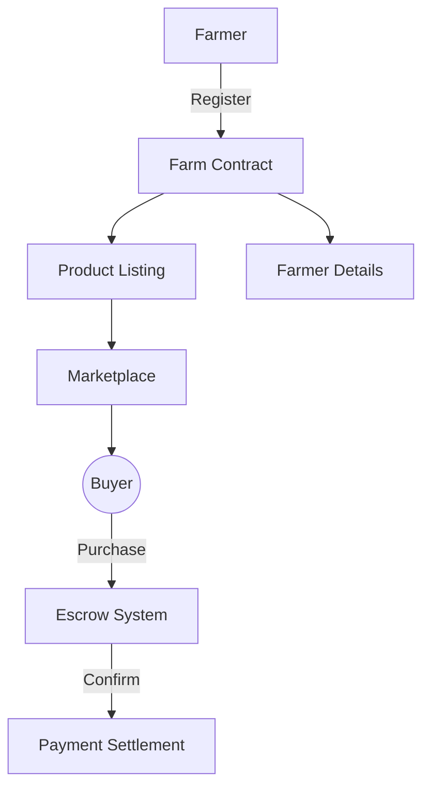
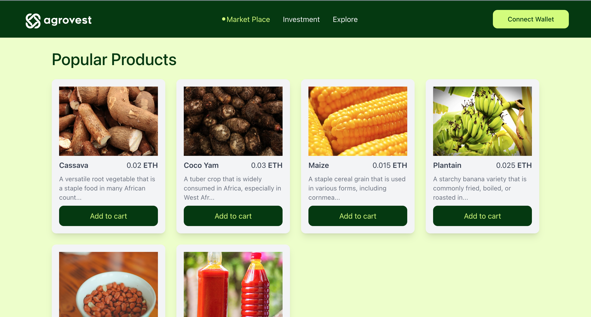
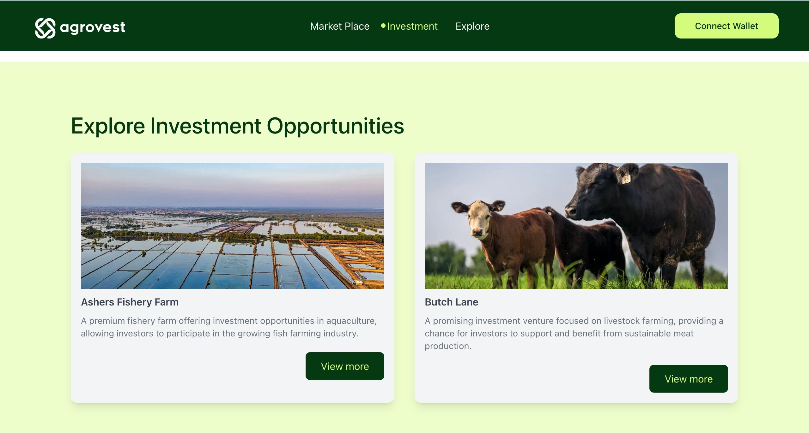

<!-- PROJECT LOGO -->
<br />
<div align="center">
  <a href="https://github.com/Signor1/agrovest-starknet">
    
  </a>

<h3 align="center">AgroVest on Starknet</h3>

  <p align="center">
    Real World Asset platform empowering African farmers through Starknet-powered tokenization
    <br />
    <a href="https://github.com/Signor1/agrovest-starknet"><strong>Explore the docs »</strong></a>
    <br />
    <br />
    <a href="https://agrovest-starknet.vercel.app/">View Demo</a>
    ·
    <a href="https://github.com/Signor1/agrovest-starknet/issues">Report Bug</a>
    ·
    <a href="https://github.com/Signor1/agrovest-starknet/issues">Request Feature</a>
  </p>
</div>

## About The Project

AgroVest is a revolutionary Real World Asset (RWA) platform built on Starknet that enables African farmers to:

✅ Tokenize agricultural assets<br>
✅ Access global investment opportunities<br>
✅ Create decentralized marketplaces<br>
✅ Manage escrow agreements through smart contracts<br>
✅ Participate in decentralized governance

## Architecture



## Built With

[![Starknet][starknet-shield]][starknet-url]
[![Cairo][cairo-shield]][cairo-url]
[![Next.js][next-shield]][next-url]
[![Tailwind][tailwind-shield]][tailwind-url]

- **Starknet Foundry** - Smart Contract Development & Testing
- **Starknet.js** - Blockchain Interactions
- **Starknet-react** - Web3 Integration
- **Scaffold-Starknet** - Development Scaffolding
- **Vercel** - Deployment & Hosting

<p align="right">(<a href="#readme-top">back to top</a>)</p>

## Key Features

<div align="center">
  
  <h4>Decentralized Marketplace</h4>
  <p>Direct farmer-to-buyer transactions with Starknet-powered escrow</p>
</div>

<div align="center">
  
  <h4>Asset Tokenization</h4>
  <p>Fractional ownership of agricultural assets using Cairo smart contracts</p>
</div>

## Contracts

- **Marketplace Contract**: [`contracts/marketplace.cairo`](https://github.com/Signor1/agrovest-starknet/blob/main/contracts/marketplace.cairo)
- **Investment Pool**: [`contracts/investment.cairo`](https://github.com/Signor1/agrovest-starknet/blob/main/contracts/investment.cairo)
- **DAO Governance**: [`contracts/governance.cairo`](https://github.com/Signor1/agrovest-starknet/blob/main/contracts/governance.cairo)

## Getting Started

1. **Clone Repo**
   ```sh
   git clone https://github.com/Signor1/agrovest-starknet.git
   ```
2. **Install Dependencies**
   ```sh
   cd agrovest-starknet
   npm install
   ```
3. **Run Frontend**
   ```sh
   npm run start
   ```

## Roadmap

- [x] Starknet Contract Scaffolding
- [x] Core Marketplace Implementation
- [x] DAO Governance Structure
- [ ] Cross-chain Bridging
- [ ] Mobile Optimization
- [ ] Farmer Onboarding Portal


## License

Distributed under the MIT License. See `LICENSE` for more information.

